# ReaderTranslator 
### using SwiftUI, Combine, Catalyst and others new features that annonced at WWDC 2019


## Каналы на русском о SwiftUI, Combine и Swift
[Swift, Xcode разработка под iOS, macOS](https://t.me/usovswift) <br>
[CocoaHeads Chat](https://t.me/cocoaheads_chat) <br>
[The Swift Developers|Сообщество разработчиков](https://t.me/joinchat/BAn0BkLMGrfpDYy2cnysNg) <br>
[Server Side Swift Developer (SSSD) - russian/ukraine/etc. (сообщество Vapor, Kitura, Perfect, Smoke, Tris)](https://t.me/server_side_swift) <br>
[SwiftUI Combine Swift 5.1+ newAppleFrameworks](https://t.me/swift_ui) <br> 

## Help
***If you mark this project with ✭. It will allow to easy find this project for other developers. Perhaps they already find more information about SwiftUI, Combine and other WWDC 2019 features in practice.
This project will allow them to get rid of wrong opinion that SwiftUI has a lot of issues and it can not be used in real projects thereby you can bring the time where requests exceed offers.***

## Support
I created Telegram group https://t.me/ReaderTranslator to support this project.
Where you can ask help questions and offer new features.
Welcome are board.

## Goals
This project targets to attract attention serious projects to SwiftUI and show its powerful. I develop this project in my free time so it would be imposible to craft such app in a short time if I used UIKit. I also use new features that announced at WWDC 2019 to show how much they are needed in morden apps.

## Base idea

> “If you can’t explain it simply, you don’t understand it well enough.” 
> by Albert Einstein

<p>Since I read a lot of books or articles in a foreign language I periodically turn to Google Translate and Reverso
to understand unfamiliar idioms, words or to find a sutable expressions or words in my native language.
And I like to listen to how a word or sentence is pronounced through the voice engine of the system or Google Translate and Reverso.</p>
<p>Although this process is simple I would like to make it as more comfortable as possible.
Sometimes I am lazy to look into the translator and I make an assumption about the meaning of a word or idiom and it can lead to a missunderstanding which turns into even greater loss of my time.</p>
<p>Another useful feature is to write text in Safari to check and listen to it with a simple selection of text.</p>

** update **
As the project progressed I am not feeling to back to UIKit. Being able to craft a new idea in a few minutes on SwiftUI inspire me to continue developing this project. The ability to concentrate on ideas rather than realizations gives freedom to my creativity. 
As I see now this project, when it already has enough useful features that I use every day. Most likely it will be the ecosystem with various services and additional apps that will help you get the language in. The project that helps to avoid the routine while you read, listen and browse info in your chosen language. Everyone can choose own convenient way to get into the foreign language. I like to move forward all time. If I can not do well now I can do it best tomorrow. I like to choose a convenient way to dive into a foreign language. I don't like to study but I like to explore.
I am going to dive into a new foreign language. I think I will get new ideas for new features to use some foreign language from scratch.

## Projects
 - macOS
 - macOS Catalyst
 - iPadOS
 - iOS
 - Safari extension

## Requirements
- macOS 10.15 Catalina
- iOS 13
- iPadOS

## How to install on macOS
- Download **ReaderTranslatorMac.dmg** from https://github.com/filimo/ReaderTranslator/releases
- Open downloaded **ReaderTranslatorMac.dmg**
- Copy **ReaderTranslatorMac** to **Applications** folder
- Open **ReaderTranslatorMac** by the right click and click **Open** button (might require two attempts) 
- Enable **ReaderTranslatorSafari** extension in Safari->Preferences->Extensions

## Important
If you want to translate selected text from Safari you should enable ReaderTranslatorSafari extension in Safari preferences
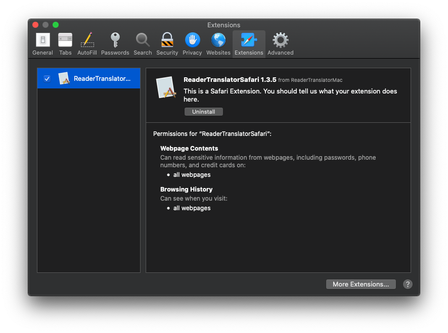

Catalyst project for macOS has some problems:
- Select a text in `WKWebView`
- Handle key events
- Support Safari extension
- Smart zoom doesn't work

iOS project seems less useful as it has a small screen to fit 3 views.
iPadOS project takes place to exist but I don't have iPad now. I going to buy it with a pencil and continue experimenting with usability.

If you want to run the project on macOS I recommend to use 'ReaderTranslatorMac' target. I keep to support Catalyst version for macOS but nowadays it has some unfixed issues noted above.

## Features
- Support MacOS, ipadOS, iOS
- Read PDF books or Web pages
- Translate selected words or sentences through *Google Translate* and *Reverso*
- Voice words or sentences though voice engines with rate speech, *Google Translate* and *Reverso*
- Adjust speech rate

## Goals
Explore features, limitations and bugs *SwiftUI, Combine and Catalyst*.

## Upcoming features in 2.0
 - Watch videos with subtitles [#55](https://github.com/filimo/ReaderTranslator/issues/55)


## Coming features
- [New features for ReaderTranslatorPlayer](https://github.com/filimo/ReaderTranslator/issues/58)
- [Sync bookmarks between macOS and mobile apps](https://github.com/filimo/ReaderTranslator/issues/63)
- [Bookmarks for mobile version](https://github.com/filimo/ReaderTranslator/issues/66)

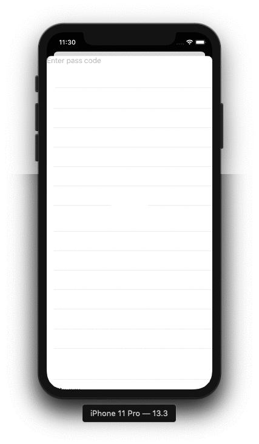

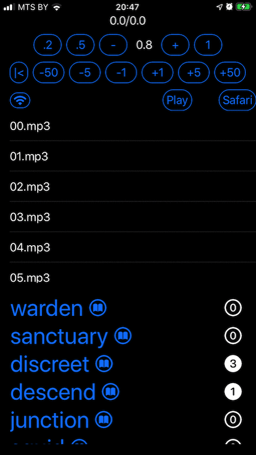
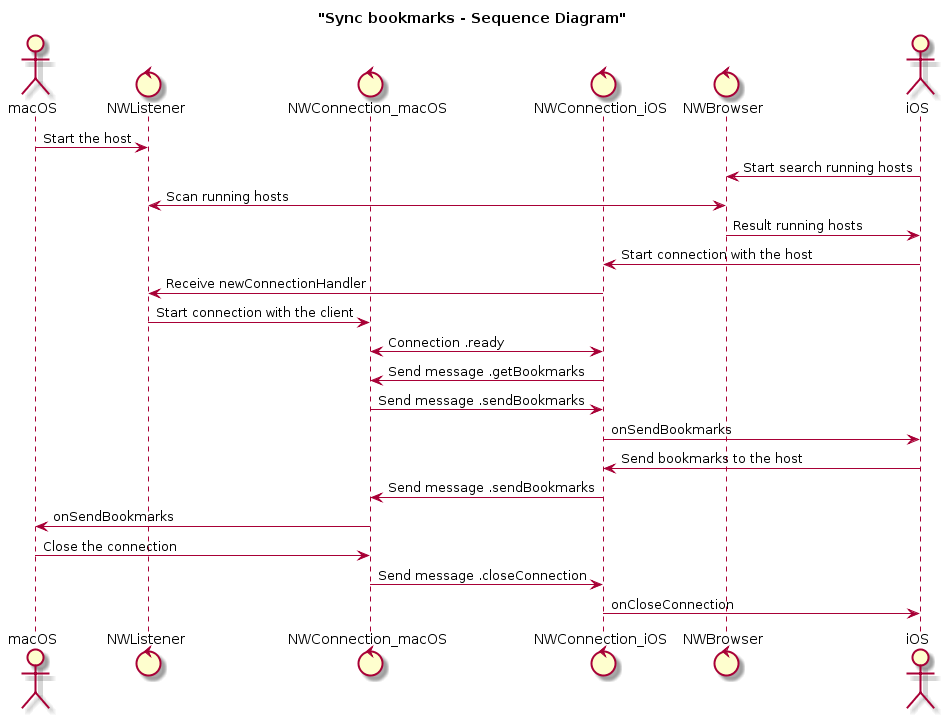

## Releases 
### Download .dmg from [here](https://github.com/filimo/ReaderTranslator/releases) 

**1.13.0**
Implemeted iPadOS target project

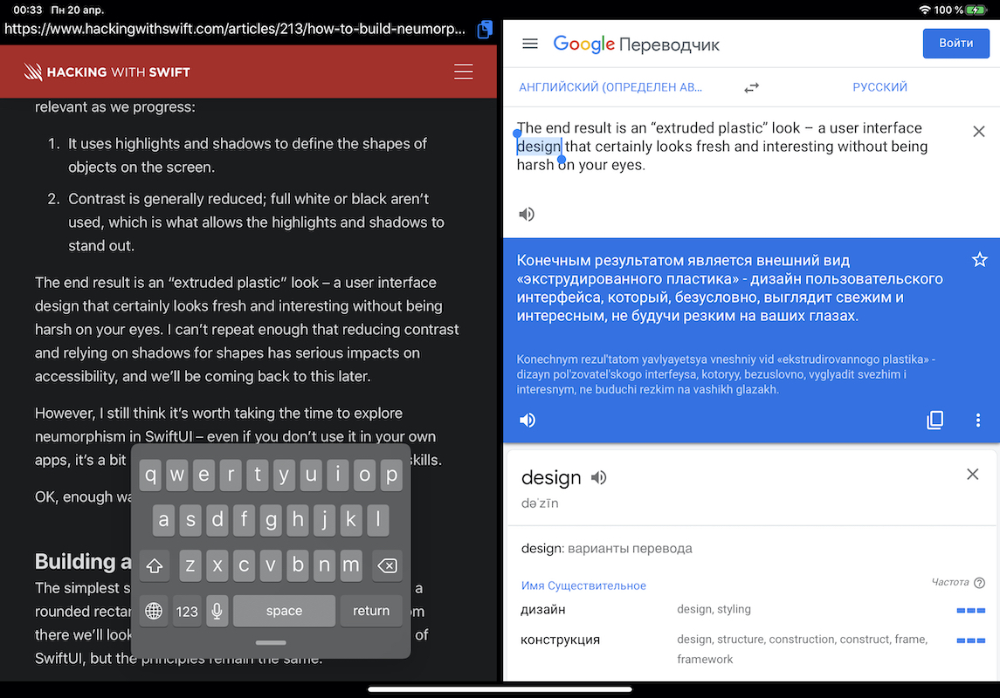

**1.12.2**
Speaking selected words and phrases by Cambridge speakers

- [Cambridge dictionary #77](https://github.com/filimo/ReaderTranslator/issues/77)

**1.12.0**
- [DeepL implemented #79](https://github.com/filimo/ReaderTranslator/issues/79)

**1.11.1**
- [Google Translate implementation #78](https://github.com/filimo/ReaderTranslator/issues/78)

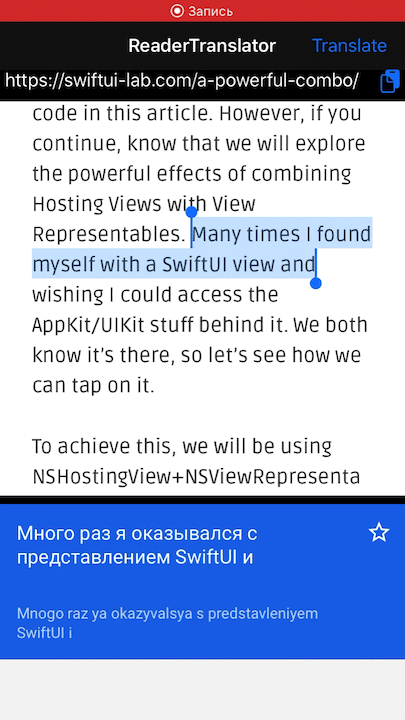


**1.11.0**
- [Cambridge dictionary #77](https://github.com/filimo/ReaderTranslator/issues/77)

**1.10.0**
- [ReaderTranslatorMobile #76](https://github.com/filimo/ReaderTranslator/issues/76)


**1.9.2**
- [Voicing selected words and phrases by Longman speakers](https://github.com/filimo/ReaderTranslator/issues/62)

**1.9.1**
- [Merriam-Webster support #75](https://github.com/filimo/ReaderTranslator/issues/75)

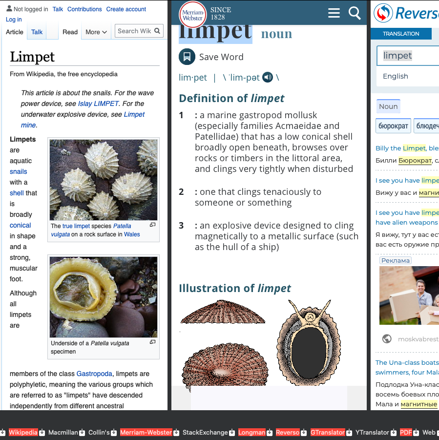

**1.9.0**
- [Actions share in ReaderTranslatorPlayer](https://github.com/filimo/ReaderTranslator/issues/74)


**1.8.5**
[Add english.stackexchange.com](https://github.com/filimo/ReaderTranslator/issues/70)

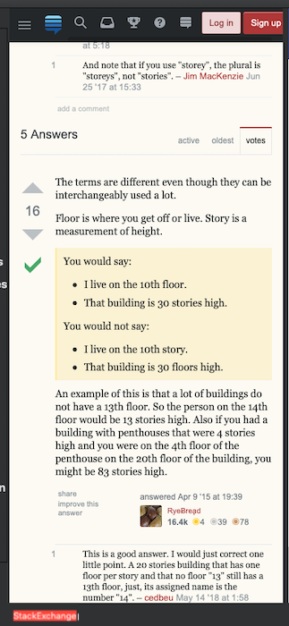

**1.8.4**
[AudioPlayer features](https://github.com/filimo/ReaderTranslator/issues/65)

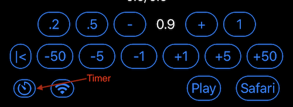

- Play next audio automatically
- Sleep timer


**1.8.2**
- [Bookmarks view new features](https://github.com/filimo/ReaderTranslator/issues/65)

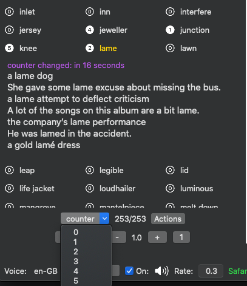

**1.8.1**
- [Single mode for all views](https://github.com/filimo/ReaderTranslator/issues/60)


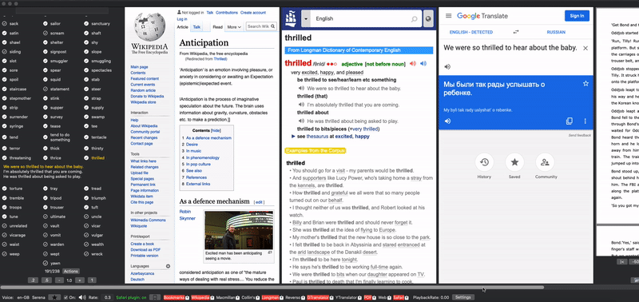

**1.8.0**
- [Bookmarks view](https://github.com/filimo/ReaderTranslator/issues/59)
- [Longman features](https://github.com/filimo/ReaderTranslator/issues/61)

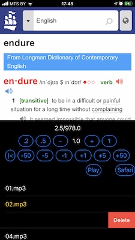
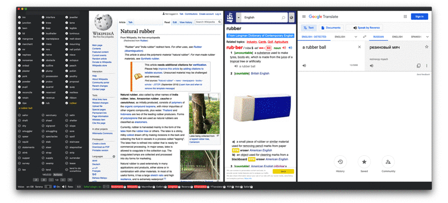

**1.7** 
Added audio player in PDF mode and audio player app for iOS [features](https://github.com/filimo/ReaderTranslator/issues/57)

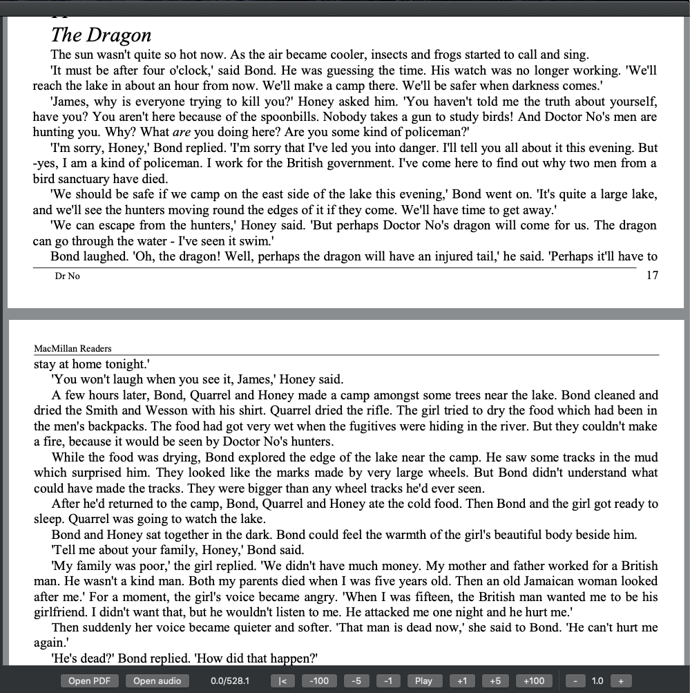
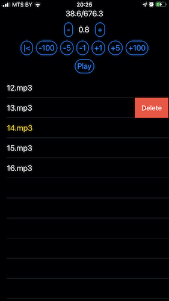

**1.6.14** 
Added Yandex.Translate

**1.6.12** New way to use ReaderTranslator with `https://developer.apple.com/videos/**`
- Navigate backward or forward through phrases and send them to ReaderTranslator by pressing LeftArrow or RightArrows key
- Go to the previous phrase, highlight it and add it to ReaderTranslator before the current text by Shift + the left arrow key
- Go to the next phrase, highlight it and add it to ReaderTranslator after the current text by Shift + the right arrow key
- Send the current phrase to ReaderTranslator / Start playing the video pressing "/" key
- Prevent to start playing video after you stop it and start to navigate through phrases
- Speed up or down speech rate by pressing "-" or "+" keys 

**1.6.11** 
- Apple videos features: Add the previous phrase to ReaderTranslator by pressing Shift + LeftArrow buttons.

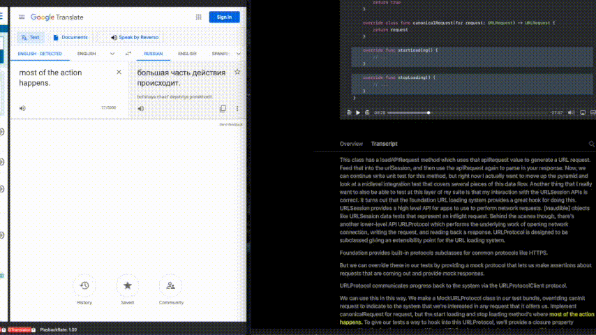

**1.6.10** Apple videos features
- Improved shortcuts functionality to convenience navigation, voicing and translations of phrases in `developer.apple.com/videos/play/` resources.

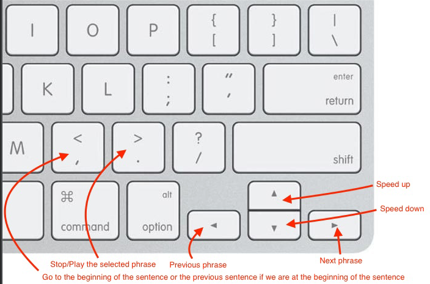

**1.6.9** 
 - Apple videos features: Send the current and previous phrase by "<" key to ReaderTranslator

**1.6.8** 
 - Apple videos features: Send the entire sentence by "f" key to ReaderTranslator


**1.6.7** Volume control

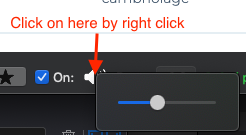

**1.6.6** Features for `https://developer.apple.com/videos/**` **Safari extension only**
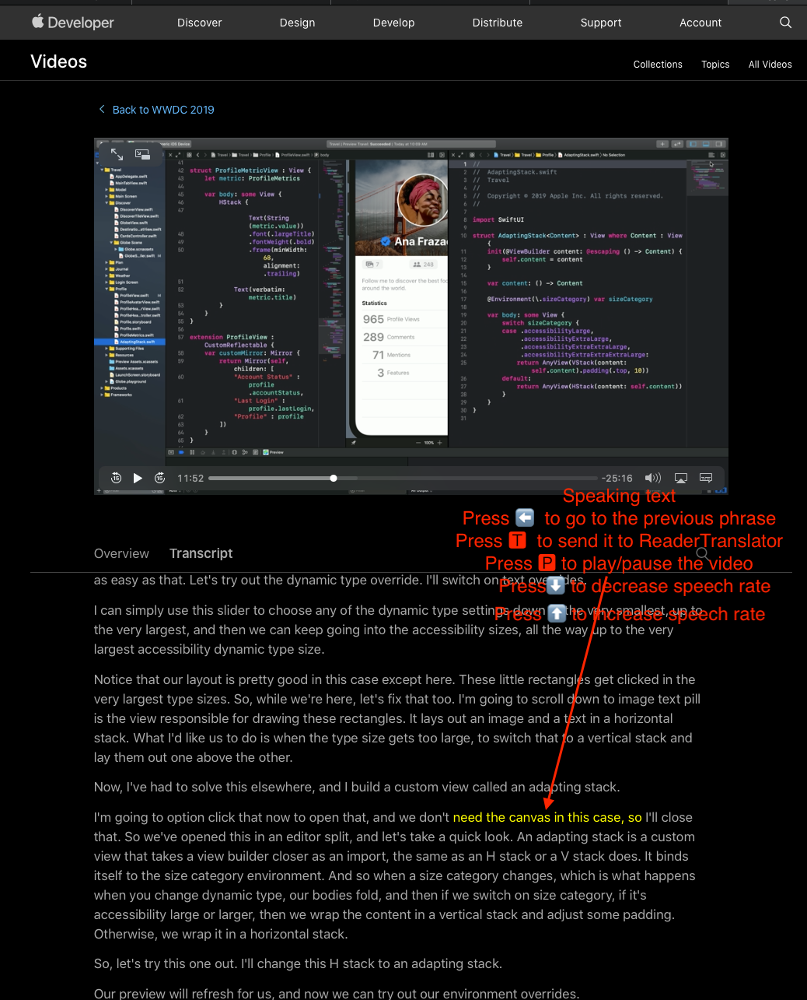
 - Press the down arrow button to decrease the speech rate
 - Press the up arrow button to increase the speech rate

**1.6.5** Features for `https://developer.apple.com/videos/**` **Safari extension only**
- Prevent bubble events when press "t", "p", left arrow button on https://developer.apple.com/videos/**
- Scroll view to the speaking sentence if it is needed on https://developer.apple.com/videos/**

**1.6.4** Features for `https://developer.apple.com/videos/**` **Safari extension only**
 - Highlight the speaking text in Apple videos transcripts
 - Go to a previous sentence by left arrow button 
 - Send selected text in transcripts to ReaderTranslator by pressing "t"
 - Play/pause apple videos by pressing "p"

**1.6**
- Implement San Francisco font to display icons on macOS corretly #49

**1.5.4**
 - Fixed getting action event in GTranslator  
 - Limit the amount of translated words for different views

**1.5.3**
 - New way to send multiple action events to views. [TranslateAction.swift](https://github.com/filimo/ReaderTranslator/tree/master/ReaderTranslator/Model/TranslateAction.swift)
 - Send selected text in any view to all enabled views.
 - Send selected text in Reverso to all enabled views  without pressing `Ctrl`  


**1.5.2**
 - Implemented SwiftLint
 - Installation: `brew install swiftlint`

**1.5**
 - Speak a word or sentences by Macmillan, Collins, Longman, Reverso speakers.
 - See explanations words in Macmillan, Collins, Longman, Reverso dictionaries.
 - Look at the information on Wikipedia 
 
 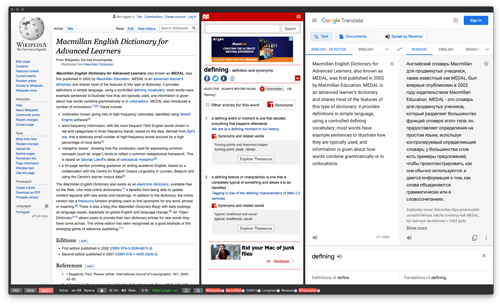
 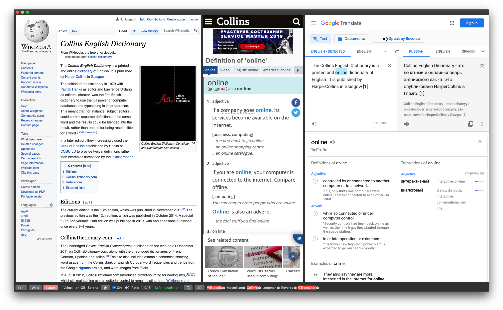
 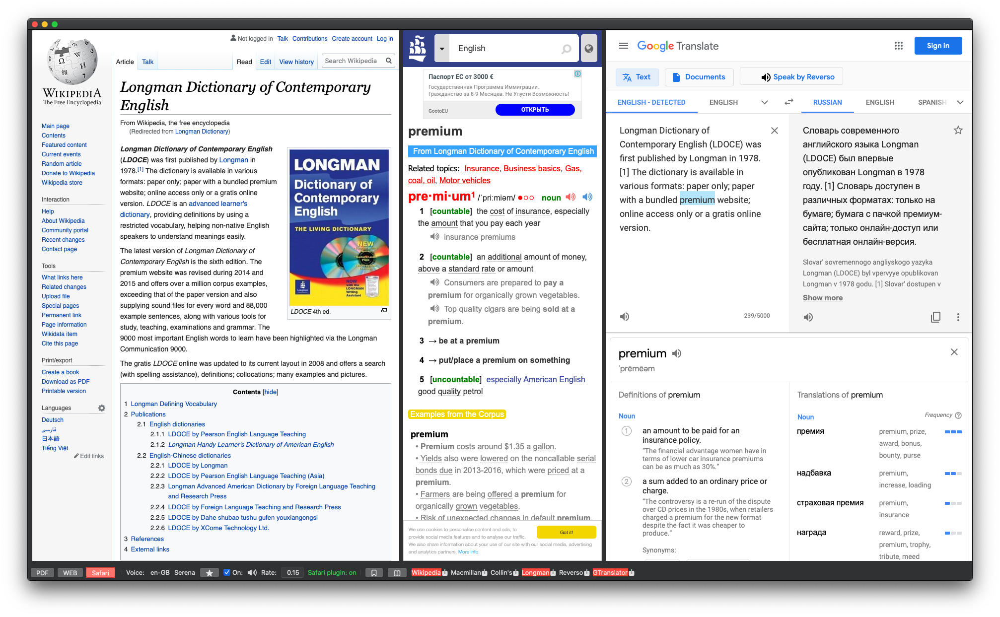
 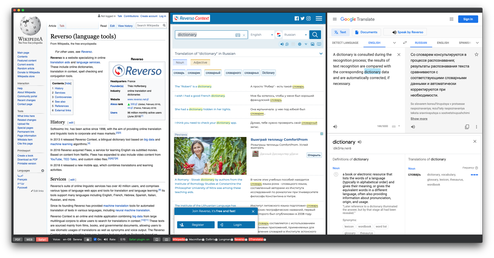
 
 - Any view can be shown or hidden by clicking on a name view.
 - Paste selected text to any view by clicking a button next to a name view
 
 

**1.4.3**
 - Open any PDF file (MacOS has restrictions on opening files hence you should select a PDF file after starting the app by clicking on `Open PDF file` in the bottom status menu`)

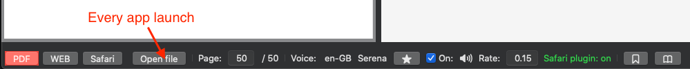

**1.4.2**
 - Fixed an issue with translating text with invalid characters in Reverso.

**1.4**
 - Open selected text by service menu items in Safari and GTranslator [#40](https://github.com/filimo/ReaderTranslator/issues/40)

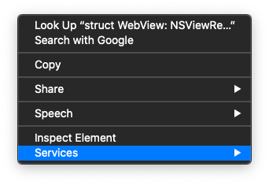
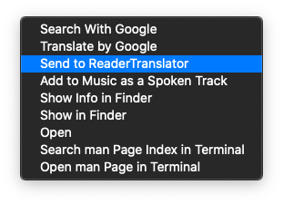

You are curious about why same text are opened in both GTranslator and Safari. There are two reasons.
First you can select a particular sentence in GTranslator to translate it in Reverso.
Second you can select a particular sentence in Safari to translate it in GTranslator.

**1.3.7**
- Build `ReaderTranslatorMac.dmg` . You can find them [here](https://github.com/filimo/ReaderTranslator/releases) 

**1.3.6**
- If there isn't selected text in GTranslator then text is spoken from input tag
- If there isn't selected text in Reverso then text is spoken from textarea tag

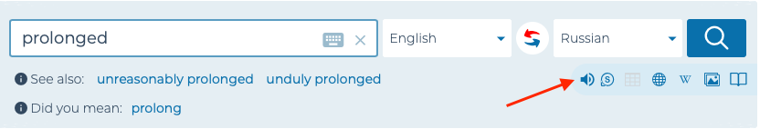


**1.3.5**
- [Bookmarks for favorite sentences](https://github.com/filimo/ReaderTranslator/issues/42)  
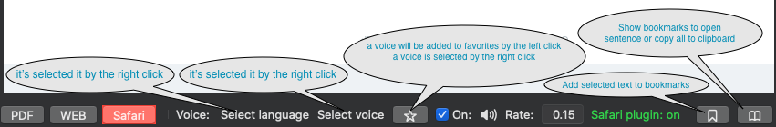

**1.3.4**
- Add button to Reverso to speak text by Reverso
- Add button to GTranslator to speak text by Reverso

**1.3.2**
- Fix: Crash the app when switching between view modes
- Fix: Translate/Speak selected text in WebPage

**1.3.0**
<p>Support *Reverso Context* [features](https://github.com/filimo/ReaderTranslator/issues/19)</p>

<p>You can use it with Safari</p>
 
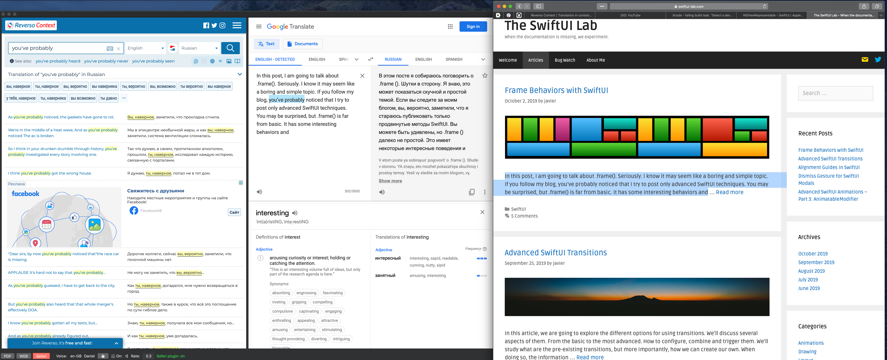
 
<p>You can use it with the build-in web browser</p>

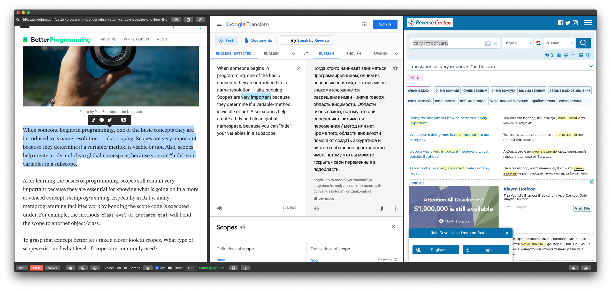
 
<p>You can use it with with the bild-in PDF viewer</p>
 
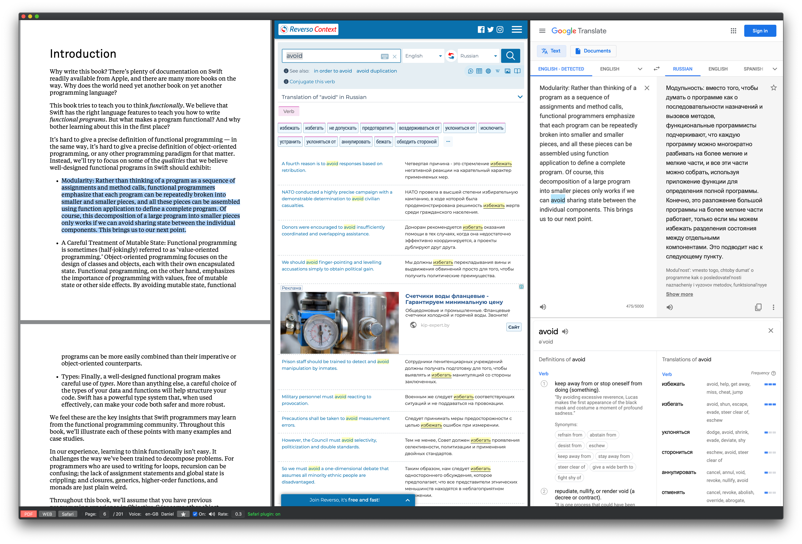

- Selected text in Safari will be sent to Reverso if it has less than 10 words
- Selected text in the build-in Google Translator will be send to Reverso
- Selected text in the build-in Reverso could be translated by pressing `Ctrl`
- Selected text in the build-in Reverso could be speaked by pressing `Alt`

New WebKit architecture [issue](https://github.com/filimo/ReaderTranslator/issues/27)
<pre><code>
           ┌────────────────┐                                  ┌────────────────┐
           │                │                                  │                │
           │      View      │────────openSafari───────────────▶│     Safari     │
           │                │                                  │                │
           └────────────────┘                                  └────────────────┘
           │                │
           │                │
       makeView        updateView                                    ┌──────────────────────┐
           │                │                                        │                      │
           ▼                ▼                   ┌───────────────────▶│        WKPage        │
           ┌────────────────┐                   │                    │                      │
           │                │               makeView                 └──────────────────────┘
           │ WKPepresenter  │───────────────────┘                    │           │          ▲
           │                │                ┌──────────────────┐    │           │          │
           └────────────────┘──makeView      │  WKScriptsSetup  │    │           │          │
                                    └───────▶│                  │ create        ┌┘   goBack handler
            ┌───────────────────────┐        └──────────────────┘    │        load          │
            │     WKCoordinator     │                  │             │          │           │
            │                       │                  │             ▼          │           │
            └───────────────────────┘                  │             ┌──────────▼───────────┐
            ▲           ▲                              │             │      WKWebView       │
            │           │                              └──setup─────▶│                      │
            │           │                                            └──────────────────────┘
            │           │              ┌────────────────────────┐    │           │
            │           │              │ WKScriptMessageHandler │    │           │
            │           └──────────────│                        │◀───┘           │
            ┌──────────────────────┐   └────────────────────────┘                │
            │ WKNavigationDelegate │                                             │
            │                      │◀──────────────────────────navigation events─┘
            └──────────────────────┘
</code></pre>

### TranslateAction [here](https://github.com/filimo/ReaderTranslator/wiki/Diagrams)

```swift
enum TranslateAction: Equatable {
    case none(text: String = "")
    case reverso(text: String)
    case translator(text: String, noReverso: Bool = false)
    
    func getText() -> String {
        switch self {
        case .none(let text): return text
        case .reverso(let text): return text
        case .translator(let text, _): return text
        }
    }
    
    mutating func setNone() {
        self = .none(text: getText())
    }
}
```
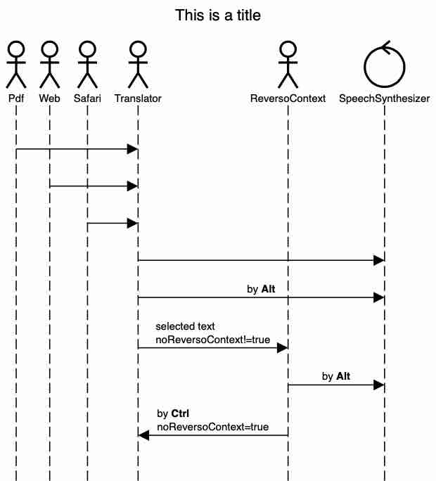


**1.2** Implemented Safari extension. You can read about coming features [here](https://github.com/filimo/ReaderTranslator/issues/15) and review [here](https://github.com/filimo/ReaderTranslator/tree/%2315_safari_plugin). It's very intresting case when we need to make commnication between the app and extentions.
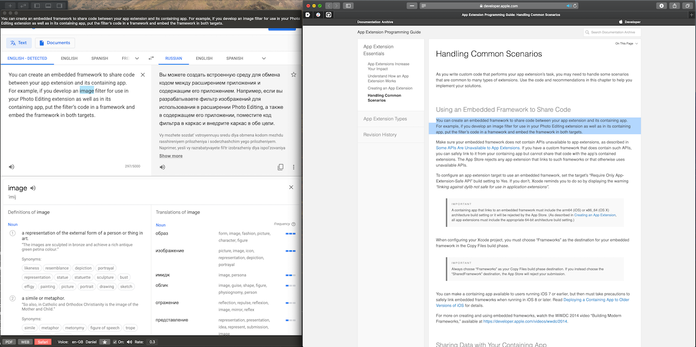


**You can help** me if you look at the list of [open bugs](https://github.com/filimo/ReaderTranslator/issues/).


