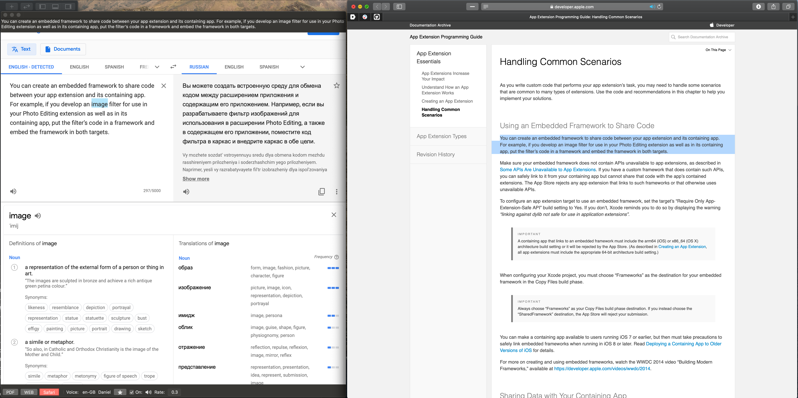
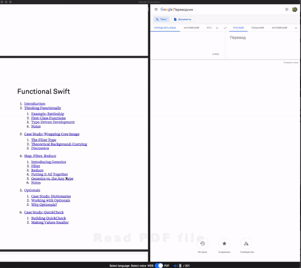
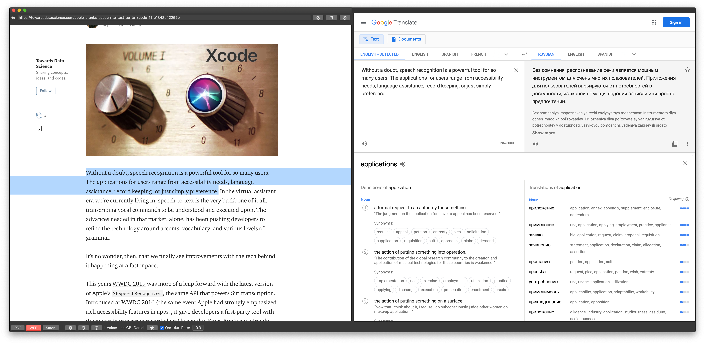
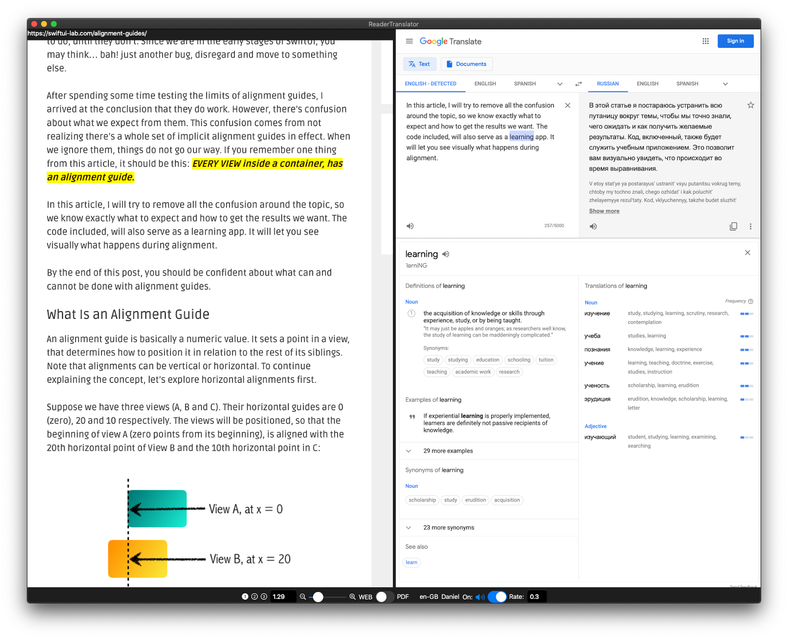
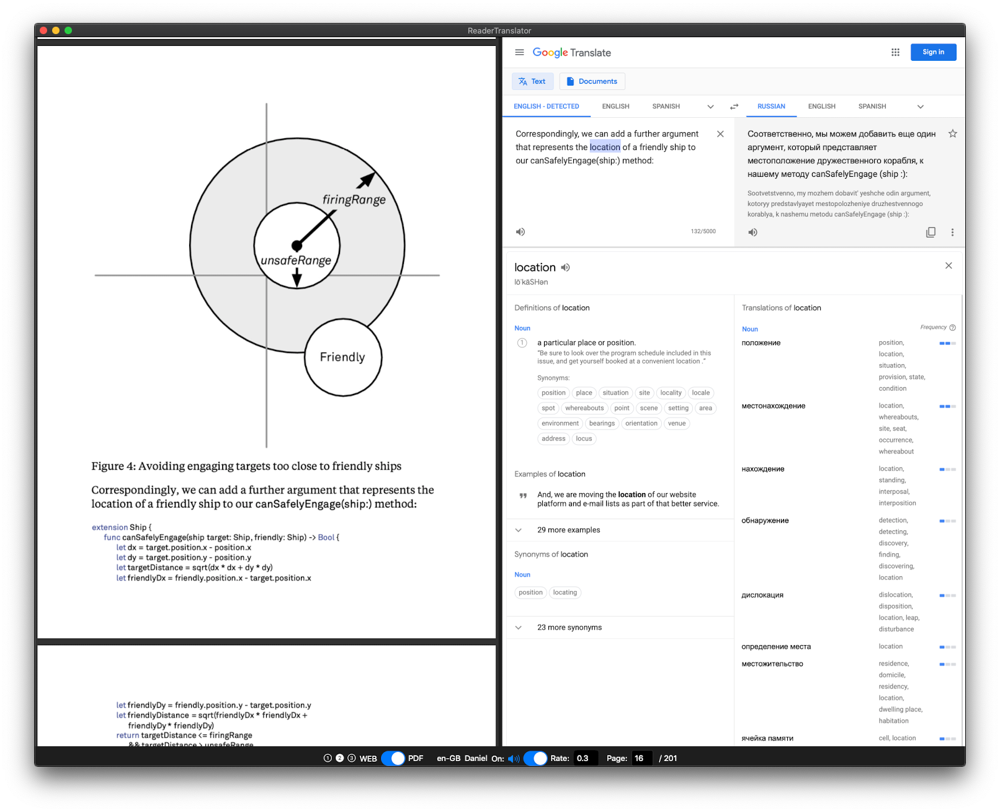
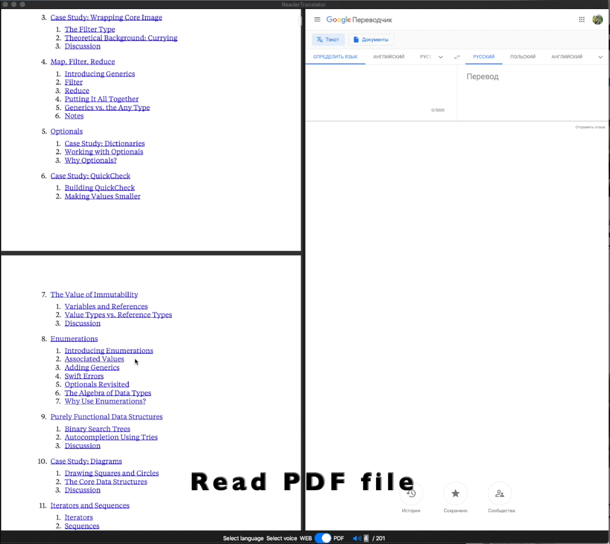
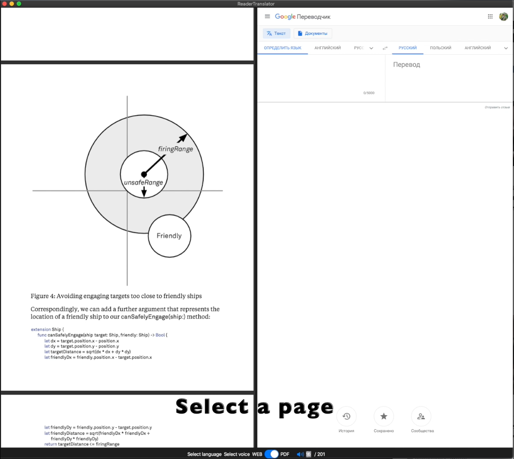

# ReaderTranslator 
**using SwiftUI, Combine and Catalyst for MacOS(Catalyst and AppKit) iPad iPhone**

# Coming soon
I almost finished implement Safari extension. You can review it in `#15_safari_plugin` branch right now. It's very intresting case when we need to make commnication between the app and extentions.

## Status
While I am waiting for the commercial **SwiftUI** projects I decided to dedicate my free time to build this open-source project.

## Base idea
Since I read a lot of books or articles in a foreign language I periodically turn to Google Translate 
to understand unfamiliar idioms, words or to find a sutable expressions or words in my native language.
And I like to listen to how a word or sentence is pronounced through the voice engine of the system or Google Translate(or others services).
Although this process is simple I would like to make it as more comfortable as possible.
Sometimes I am lazy to look into the translator and I make an assumption about the meaning of a word or idiom and it can lead to a missunderstanding which turns into even greater loss of my time.

## Features
- Support MacOS, ipadOS, iOS
- Read PDF books or Web pages
- Translate selected words or sentences through *Google Translate*
- Voice words or sentences though voice engines with rate speech
- Adjust speech rate

## Goals
Explore features, limitations and bugs *SwiftUI, Combine and Catalyst*.

**You can help** me if you look at the list of [open bugs](https://github.com/filimo/ReaderTranslator/issues/).

